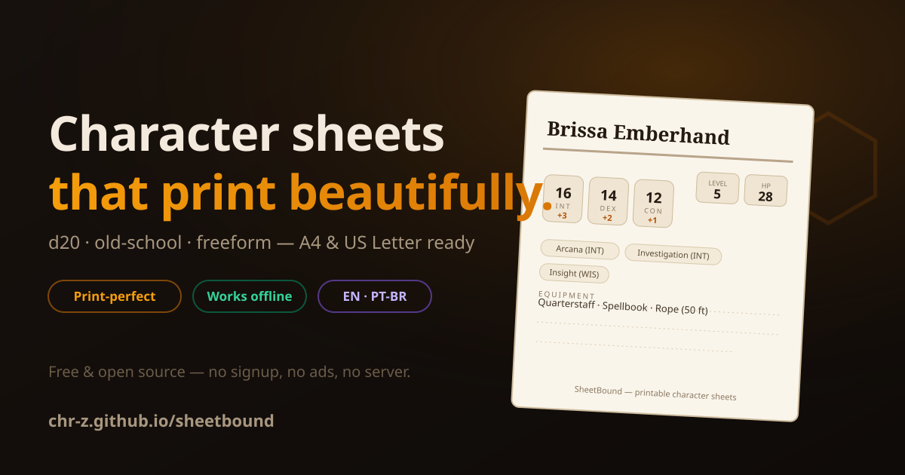

# 🎲 SheetBound

**Printable character sheets for d20, old-school & freeform tabletop RPGs.**

🔗 **Live demo:** **[chr-z.github.io/sheetbound](https://chr-z.github.io/sheetbound/)** · free, no signup

---

Game night is tomorrow, the dice bag is ready — and your character sheet is a
photo of a photocopy. **SheetBound** fills that gap: pick a system, roll or type
your scores, watch the live paper preview update, and hit print. What comes out
of the printer looks like it came with the boxed set — on A4 *and* US Letter.

Three systems, zero accounts:

| System | What you get |
|---|---|
| ⚔️ **d20** | Six abilities with auto modifiers, proficiency bonus by level, passive perception, 18 skills, carrying capacity (STR × 15 lb), XP → level tracking on the official 1–20 table |
| 🗡️ **Old-School (OSR)** | 3–18 scores, classic six saving throws (Death Ray, Wands, Paralysis, Dragon Breath, Spells, Devices), level cap 8, B/X-style XP table |
| ✨ **Freeform** | No numbers at all — traits, bonds, flaws and gear for narrative games |

## ✨ Features

- 👁️ **Live paper preview** — edit on the left, watch the parchment sheet redraw in real time
- 🖨️ **Print-perfect output** — dedicated `@media print` stylesheet; editor disappears, sheet stays. A4 & US Letter friendly
- 🎲 **4d6-drop-lowest roller** — one click rolls all six scores and assigns them by priority (CON/DEX first)
- 🧮 **Real rules math** — ability modifiers `floor((score−10)/2)`, proficiency bonus `2+⌊(lvl−1)/4⌋` (+2→+6), XP thresholds from the official 20-level table
- 💾 **Auto-save & JSON export/import** — work is saved to `localStorage` continuously; export versioned JSON, import anywhere
- 📦 **Schema migration built-in** — v1 flat sheets (`{str: 14}`) auto-upgrade to the current format on load
- ⚠️ **Encumbrance warning** — overload your STR score and SheetBound tells you before the DM does
- 📴 **Offline-first PWA** — installable; works at the table with no Wi-Fi (which is where tables usually are)
- 🌍 **Global-first i18n** — English & Português (BR) with header selector
- ♿ **Accessible** — labeled inputs, focus rings, `aria-live` status, semantic tables

## 🚀 First sheet in 60 seconds

1. Open the [demo](https://chr-z.github.io/sheetbound/) — a demo character is already filled in
2. Click **Roll 4d6 drop lowest** (or type your own scores)
3. Hit **Print / Save PDF**

That's it. The demo data loads in under a second — no signup wall, no "create project" wizard.

## 📸 Screenshots

> Live app — dark parchment editor + real-time paper preview:

| Editor & live preview | Print output = what you get |
|---|---|
| Open the [demo](https://chr-z.github.io/sheetbound/) to see it live | Press **Print / Save PDF** — clean B/W sheet |

*(Screenshots coming with the v1.1 polish pass — the hero above is rendered from the actual UI palette.)*

## 💰 Pricing

| | Free | System Packs *(planned)* |
|---|---|---|
| All 3 systems (d20 / OSR / freeform) | ✅ | ✅ |
| Unlimited characters, offline PWA | ✅ | ✅ |
| Print & PDF export | ✅ | ✅ |
| Extra system packs (Cyberpunk, horror, kids' RPG…) | — | ✅ |
| Party export (zip of sheets) | — | ✅ |
| Price | **$0** | $4/pack one-time |

No account, no telemetry, no server. Your heroes never leave the device.

## 🗺️ Roadmap

- [x] d20, OSR & freeform systems with derived-stat engine
- [x] Live print preview + A4/Letter print stylesheet
- [x] Offline-first PWA (installable)
- [x] JSON export/import with schema migration
- [ ] More system packs (Cyberpunk-ish, cosmic horror, kids' first RPG)
- [ ] Party view: multiple characters, one printable booklet
- [ ] Spell-sheet companion page
- [ ] QR code linking a read-only sheet for the GM

## 🛠️ Tech notes

- **Zero runtime dependencies** — vanilla ES modules, no build step
- **19 tests** on the business core via `node --test` (dice math, modifiers, XP tables, validation, migration, serialization)
- Logic layer (`js/logic.js`) is DOM-free and imports cleanly into Node — that's why the test suite is honest
- Lighthouse-friendly: no render-blocking third parties, service-worker precache, semantic HTML

## 🤝 Contributing

PRs welcome — see [CONTRIBUTING.md](CONTRIBUTING.md). Rule zero: business logic stays in `js/logic.js`, tested and DOM-free.

## 📄 License

[MIT](LICENSE) — free for personal and commercial use.

---

**Built by [@chr-z](https://github.com/chr-z)** · part of a 10-app zero-dependency SaaS portfolio

